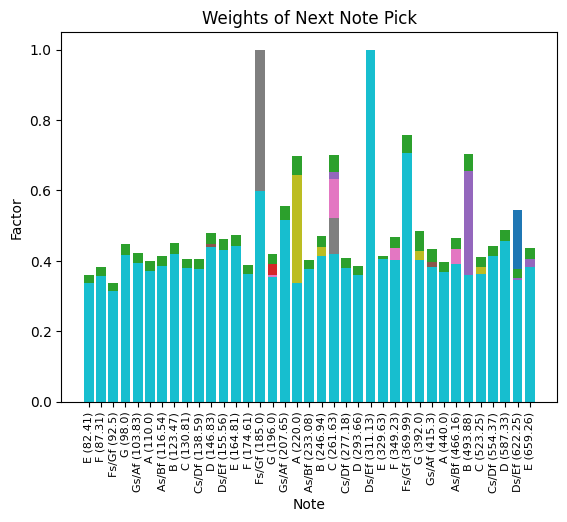
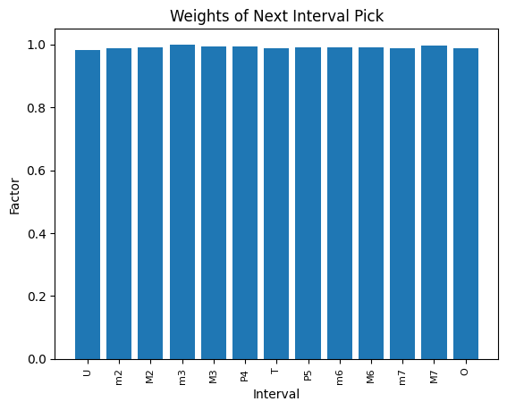

# Learn Fretboard

Learn Fretboard is a Python based game for memorizing the guitar fretboard. A simple yet very effective game to associate and remember all notes and intervals of the guitar, applying colour associations.

Your weakest (slowest and least accurate) notes and intervals are trained first, ensuring you develop a true understanding of the fretboard. 

## Screenshot

Below is the default setup for Learn Notes. Grey notes are exposed on a correct guess. All colours are mutable.


Learn Intervals is an extension game after you've mastered the notes.


## Installation

Requires Python3 and Pygame

```bash
pip install pygame
```

## Usage

Playing *Learn Notes*

```bash
python play_notes.
```

Playing *Learn Intervals*

```bash
python play_intervals.
```

## Local Saved Data

Your accuraries for every note and interval is stored in /saved_data/ as `.pickle` files. Delete this directory to restart progress.

## Probabilities and Metrics

The probability distribution of getting the next note/interval are located at `next_note_prob.png` and `next_interval_prob.png`, and is useful to visualize your learning progress. 





## Contributing
Pull requests are welcome. For major changes, please open an issue first to discuss what you would like to change.


## License
[MIT](https://choosealicense.com/licenses/mit/)
